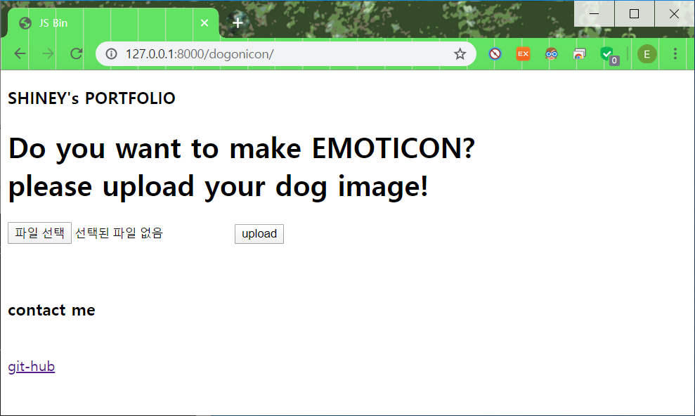

# [PORTFOLIO] day1. image upload  , save, load

---

## 1. 개요

- input으로 dog image를 올리면, 이 사진으로  이모티콘을 만들어서 보여주는 웹 페이지

## 2. portfolio dir에서 수정
#### 1. settings.py : INSTALLED_APPS에 추가, STATICFILED_DIRS  추가
```
INSTALLED_APPS = [
    'django.contrib.admin',
    'django.contrib.auth',
    'django.contrib.contenttypes',
    'django.contrib.sessions',
    'django.contrib.messages',
    'django.contrib.staticfiles',
    'dogonicon',
]


STATICFILES_DIRS = [
    os.path.join(BASE_DIR, 'static'),
    ]
```

#### 2. urls.py: urlpatterns 추가

```
urlpatterns = [
    path('admin/', admin.site.urls),
    path('dogonicon/', include('dogonicon.urls')),
]

```

## 3. dogonicon dir 수정
#### 1. urls.py 생성
```
from django.contrib import admin
from django.urls import path, include
from . import views

urlpatterns = [
    path('', views.UploadView.as_view(), name = 'UPLOAD'),
]
```

#### 2. views.py 수정 : View class이용
- [Django_Base views](https://docs.djangoproject.com/en/3.0/ref/class-based-views/base/)
- 127.0.0.1/8000/dogonicon이 입력되면 get방식으로 이미지를 업로드하는 페이지 호출
- 이미지를 static 폴더에 저장한 후, post 방식으로 업로드된 이미지를 보여주는 페이지 호출
```
class UploadView(View):
    def get(self, request):
        return render(request, dogonicon/image_upload.html')

    def post(self, request):
        file = request.FILES.get('filename', '')
        filename = file._name

        if file == '':
            return HttpResponse('file을 다시 upload해주세요')
        else:
            fp = open(settings.BASE_DIR +/static/dogonicon/' + filename, 'wb')
            for chunk in file.chunks():
                fp.write(chunk)
            fp.close()
         
        context= {'data': filename}

        return render(request, dogonicon/image_result.html', context)

```

#### 3. base.html 

- 웹페이지의 통일성을 위해 간단하게 구현, 추후 보강 예정

  ```
  <div id=header>
      <h3>SHINEY's PORTFOLIO</h3>
  </div>
  <div id=upload>
      
      
  </div>
  <div id=footer>
      <h6>contact me</h6><br>
      <a href="https://github.com/shiney5213">git-hub</a>
  </div>
  ```

  #### 4. image_upload.html

  - base.html안에 들어갈 내용
  - 이미지를 입력받을 수 있는 형식을 form을 사용하여 구현

  ```
  
  
  <h1> Do you want to make EMOTICON? <br>
      please upload your dog image!
  </h1>
  <form aceion='upload' enctype="multipart/form-data" method = 'POST'>
  	
  	<input type = 'file' name = 'filename'>
  	<input type = 'submit' value = 'upload'>
  </form>
  
  
  ```

  #### 5. image_result.html

  - 입력받은 이미지를 static안에 저장한 후, 다시 불러와서 보여주기

    ```
    
    <h3>File Upload Success</h3>
        
    ```

  #### 6. 구현된 결과

  <table>
      <tr>
      <td> </td>
      <td> </td>
      </tr>
  </table>

  

