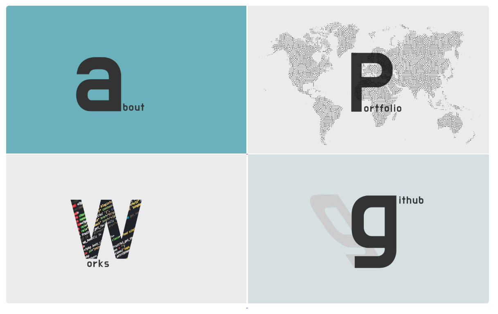

# SHINEY's Portfolio 웹 페이지 만들기

## 1. main page

#### 4개 메뉴가 보이고, 선택해서 다음 page로 연결되는 main page

- settings.py

  ```
  STATICFILES_DIRS = [
      os.path.join(BASE_DIR, 'static'),
      ]
      
  TEMPLATES = [
      {
          'BACKEND': 'django.template.backends.django.DjangoTemplates',
          'DIRS': ['templates'],
          'APP_DIRS': True,
  ```
- urls.py

    ```
    urlpatterns = [
        path('admin/', admin.site.urls),
        path('', views.home, name = 'home'),
        ]
    ```

- views.py

   ```
      from django.shortcuts import render
      from django.http import HttpResponse
      
      def home(request):
          return render(request, 'home.html')
   ```
-  home.html
  ```
<body>
	<div class = 'wrapper1'>
		<a href="portfolio/"> </a>
		<a href="portfolio/"> </a>
	<div class = 'wrapper2'>
	<a href="portfolio/"> </a>
		<a href="portfolio/"> </a>
	</div>
	</body>
```
  
  

---

## 2. Portfolio page

#### 2.1. 여러 portfolio 이미지가 슬라이드쇼로 보여주기

- 