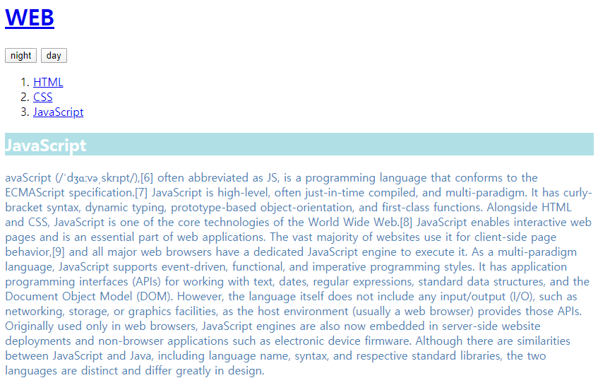

# JavaScript

---

- [생활코딩-JavaScript](https://opentutorials.org/course/3085) 강의를 공부한 예제입니다
- 자바스크립트를 공부하는 이유: 웹 어플리케이션에도 관심이 있고,  데이터 시각화(D3js 등)를 하고 싶기 때문입니다.

---

## 1. [BASIC](https://github.com/shiney5213/HTML-CSS-study/blob/master/JavaScript/1.basic.html)

#### 1.1 event

-  onclick= "자바스크립트 언어"
- html: 한번 설정되면 바뀌지 않는 정적인 언어지만, JavaScript를 이용하면 바뀔 수 있는 동적인 언어임.

```
<input type = 'button' value = 'night' onclick= "
document.querySelector('body').style.backgroundColor = 'black';
document.querySelector('body').style.color = 'white';
">
<input type = 'button' value = 'day' onclick = "
document.querySelector('body').style.backgroundColor = 'white';
document.querySelector('body').style.color = 'black';
">
```

<table>
    <tr>
    <td></td>
    <td></td>
    </td>
</table>


#### 1.2 CSS

- 특정 태그를 CSS로 디자인할 때, 태그 안에 style 속성 이용

  ```
   <h2 style = 'background-color: powderblue;color = white;'>JavaScript</h2>
   <p style = color:steelblue>avaScript (/ˈdʒɑːvəˌskrɪpt/),[6] often abbreviated as JS, is a programming language that conforms to the ECMAScript specification.[7] 
          JavaScript is high-level, often just-in-time compiled, and multi-paradigm....
   </p>
  ```

   

- Selector : 자바스크립트에서 동적으로 제어하기 위해 CSS의 태그, id, class를 선택할 수 있음.

  ```
  element = document.querySelector(selector);
  ```

- style

  ```
  document.querySelector('body').style.backgroundColor = 'black';
  document.querySelector('body').style.color = 'white';
  ```


#### 1.3. HTML vs JavaScript

- program: 예정된 순서.  -> 시간의 순서에 따라 실행되어야 할 기능

- programing: 순서를 만드는 행위 -> 시간의 순서에 따라 실행되어야 할 기능을 프로그래밍 언어로 구현하는 것.

- HTML: 컴퓨터 언어 . 웹 페이지를 묘사한 것.(시간의 순서 없이)

- JavaScript: 프로그래밍 언어, 사용자와 상호작용하기 위해 고안된 언어. 시간의 순서에 따라 웹브라우저의 여러 기능들이 실행되어야 함.

  - 조건문, 반복문: 조건에 따라 , 반복해서 어떤 기능을 실행하고 싶을 때
  
  - 함수: 순서의 배치가 복잡해짐에 따라 잘 정리정돈할 수 있음.

---

## 2.[ 조건문(Conditianal Statements)](https://github.com/shiney5213/HTML-CSS-study/blob/master/JavaScript/2.conditional_statements.html)

#### 2.1. 형식

  ```
  document.write('1<br>');
  if(true){
    document.write('2<br>');
  }else{
    document.write('3<br>');
  }
  document.write('4<br>');
  ```
#### 2.2. 조건문 활용

```
<H2>toggle button</H2>
<input id = 'night_day' type="button" value = 'day' onclick="
  if (document.querySelector('#night_day').value =='night'){
    document.querySelector('body').style.backgroundColor= 'white';
    document.querySelector('body').style.color = 'black';
    document.querySelector('#night_day').value = 'day';
  }else{
    document.querySelector('body').style.backgroundColor= 'black';
    document.querySelector('body').style.color = 'white';
    document.querySelector('#night_day').value = 'night';
  }
">
```
<table>
    <tr>
    <td></td>
    <td></td>
    </td>
</table>

## 3. Refactoring
- 코드의 기능은 그대로 두고, 코드를 효율적으로 만들어서 개선하는 것
	- 가독성을 놓이고, 유지보수 편리하도록, 중복 코드 없애기 등 
#### 3.1 버튼이 여러개 있다면
- onclick 안에 있는 태크가 자지 자신을 가리키고 있을 때 this 사용
- document.querySelector('#night_day')-> this로 교체
```
<H2>Refectoring button</H2>
<input  type="button" value = 'day' onclick="
  if (this.value =='night'){
    document.querySelector('body').style.backgroundColor= 'white';
    document.querySelector('body').style.color = 'black';
    this.value = 'day';
  }else{
    document.querySelector('body').style.backgroundColor= 'black';
    document.querySelector('body').style.color = 'white';
    this.value = 'night';
  }
">
```
#### 3.2 중복을 최대한 없애기
- 변수 사용하기
```
<input  type="button" value = 'day' onclick="
    var target = document.querySelector('body');
    if (this.value =='night'){
        target.style.backgroundColor= 'white';
    	target.style.color = 'black';
    	this.value = 'day';
    }else{
    	target.style.backgroundColor= 'black';
    	target.style.color = 'white';
    	this.value = 'night';
    }
">
```


## 4. 반복

#### 4.1.[배열](https://github.com/shiney5213/HTML-CSS-study/blob/master/JavaScript/3.array.html)

- 배열(array): 연관된 데이터를 정리정돈하여 담기 위한 수납상자

```
<h1>Array</h1>
<h2>Syntax</h2>
<script>
  var coworkers=['one', 'two', 'three'];  # 생성
  document.write(coworkers[0]);            # get
  document.write(coworkers[1]);
  document.write(coworkers[2]);
  coworkers.push('four')                 # add
  document.write(coworkers.length);      # length
</script>
```

#### 4.2. [반복문](https://github.com/shiney5213/HTML-CSS-study/blob/master/JavaScript/3.loop.html)

- 프로그램의 흐름을 제어

```
var i = 0;
while(i < 3){
  document.write('<li>2</li> ')
  document.write('<li>3</li> ')
  i += 1;
}
```

#### 4.3. [배열 & 반복문](https://github.com/shiney5213/HTML-CSS-study/blob/master/JavaScript/3.loop%2Carray.html)
- 배열: 순서대로 연관된 데이터를 정리정돈
- 반복문: 배열에 있는 데이터를 하나씩 꺼내어 자동화된 처리를 할 수 있음.
```
<h2>Number Array</h2>
<script>
    var number=['One','Two', 'Three', 'Four', 'Five', 'Six'];
</script>
<ul>
    <script>
    var i = 0;
    while(i<number.length){
        document.write('<li><a href = "http://a.com/'+number[i]+'">'+number[i]+'</a></li>');
        i =i +1;
    }
    </script>
</ul>
```


```
var links = document.querySelectorAll('a');
var i = 0;
while(i<links.length){
  links[i].sthle.color = 'pow'

}
```


#### 4.2. 반복문

- 


---

## 5. 함수

- 


## 6. 객체