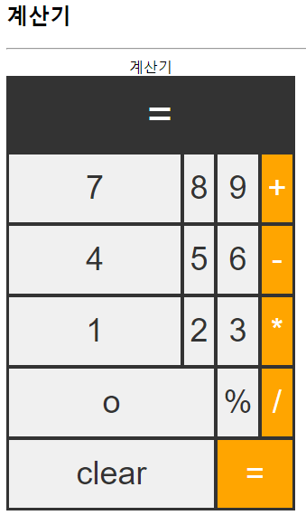
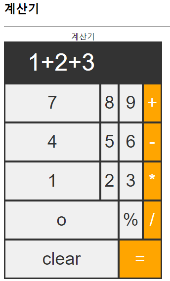
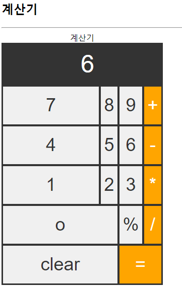

# 자바스크립트 프로젝트 북

---

## 1. 프로젝트 

#### 1. [계산기]((https://github.com/shiney5213/Study-Programming/blob/master/JavaScript/book-JavaScript_Project/2.실전프로젝트_6.프로젝트1(계산기).ipynb)
- form 객체

- this 객체

- eval()함수: 입력된 값을 그대로 처리

- html
	- <th> : table head
	-  conspal: 열 합치기
	
<table>
  <tr>
  <td></td>
  <td></td>
  <td></td>  </tr> </table>

---

## 2. 기억할 것

#### 1. [form 태그](https://github.com/shiney5213/Study-Programming/blob/master/JavaScript/book-JavaScript_Project/2.실전프로젝트_6.프로젝트1(계산기).ipynb)
- 다양한 정보를 입력받을 때 사용

- form 객체 가져오기
  - document.formName.typeName.속성
  - document.forms['formalName']['typeName'].속성