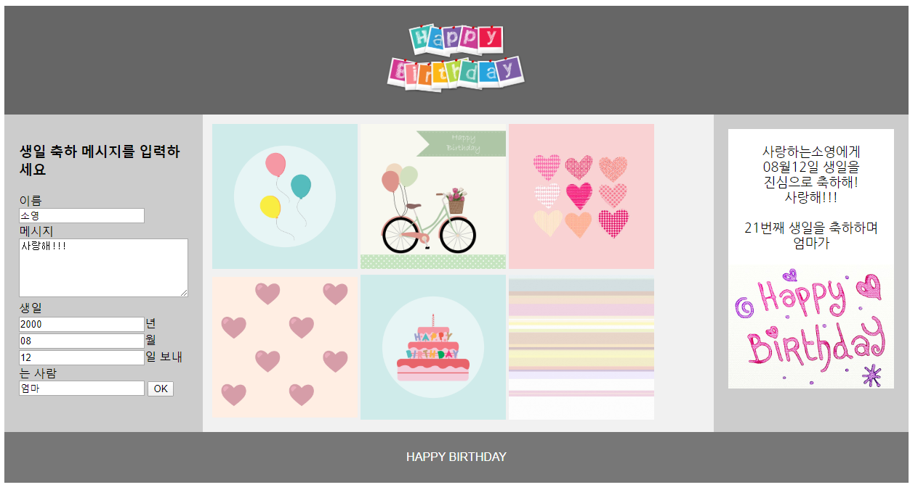
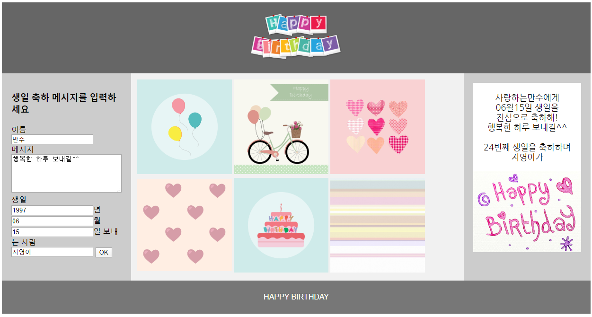
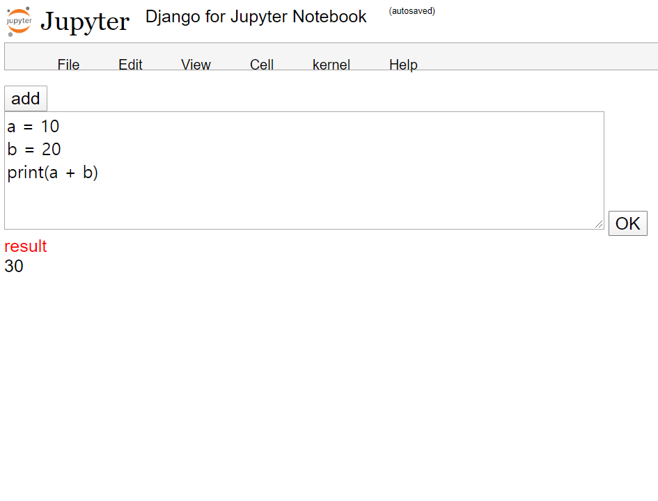
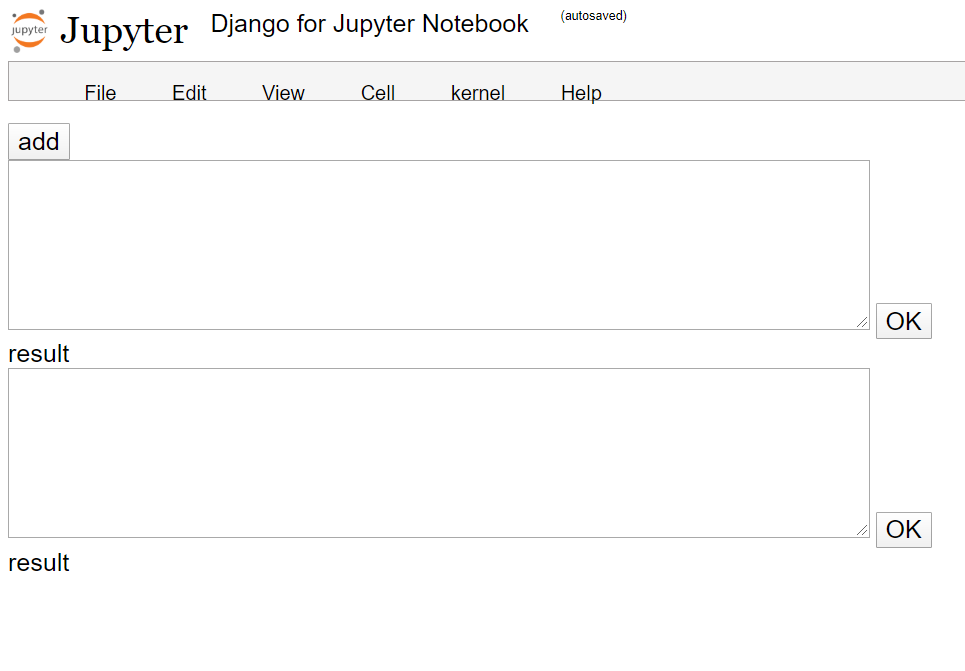

# HTML, CSS, JS 

---

##  HTML, CSS 
- [HTML_BASIC](https://github.com/shiney5213/HTML-CSS-study/blob/master/HTML%2CCSS/1.1_HTML_basic.html) : ui, li, div 개념 익히기
- [HTML_STRUCTURE](https://github.com/shiney5213/HTML-CSS-study/blob/master/HTML%2CCSS/1.2_HTML_structure.html) : header, section, nav, botton 개념 익히기
- [HTML_CSS](https://github.com/shiney5213/HTML-CSS-study/blob/master/HTML%2CCSS/1.3. CSS_id%2C class.html) : id, class 개념 익히기
<table>
    <tr>
    <td></td>
    <td></td>
    <td></td>    
    </tr>
</table>

---

##  Flask 
- [Html  video](https://github.com/shiney5213/HTML-CSS-study/blob/master/HTML%2CCSS/2.1.flask_image%2Cvidio.html) : table, font-family, video 개념 익히기
- [Html yolo](https://github.com/shiney5213/HTML-CSS-study/blob/master/HTML%2CCSS/2.2.flask_image%2Cyolo.html) : img upload, delete, yolo 이용해서 Image Detection
- [Flask_yolo](https://github.com/shiney5213/HTML-CSS-study/blob/master/HTML%2CCSS/2.1_flask_web.py) : get, post method, template 
<table>
    <tr>
    <td></td>
    <td></td>
    <td></td>    
    </tr>
</table>

---

##  Django
#### 1. Happy Birthday to You
- AJAX 개념 익히기: 비동기식 개념 익히기
- [views.py](https://github.com/shiney5213/HTML-CSS-study/blob/master/Django/mysite/birthday/views.py) : controler역할. input함수,output 함수 구현
- [input.html](https://github.com/shiney5213/HTML-CSS-study/blob/master/Django/mysite/TEMPLATES/birthday/input.html) : 127.0.0.1:8000/birthday/input 에서 왼쪽에 값 입력하면 오른쪽 화면에 메시지 출력
<table width = 600>
    <tr>
    <td></td>
    <td></td>
    </tr>
</table>

#### 2. Jupyter notebook

   - [view.py](https://github.com/shiney5213/HTML-CSS-study/blob/master/Django/mysite/jupyter/views.py): input함수에서 파이썬 코드를 입력하면 output 함수에서 code를 실행한 결과를 출력

   - [nootebook.html](https://github.com/shiney5213/HTML-CSS-study/blob/master/Django/mysite/TEMPLATES/jupyter/notebook.html):  jupyter notebook의 코드 입력, 실행, 셀 추가 기능 구현

   - <table width = 600>
         <tr>
         <td></td>
         <td></td>
         </tr>
     </table>