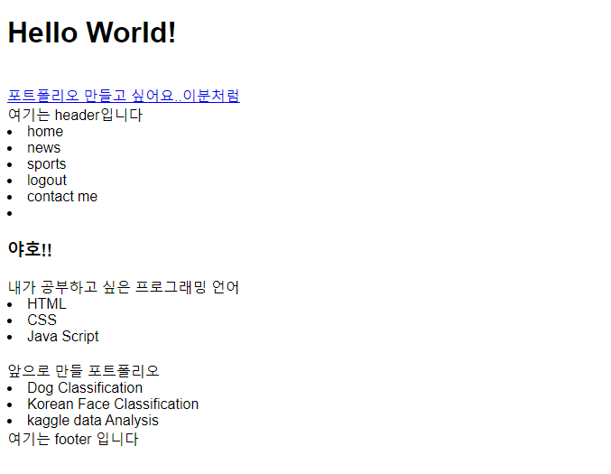
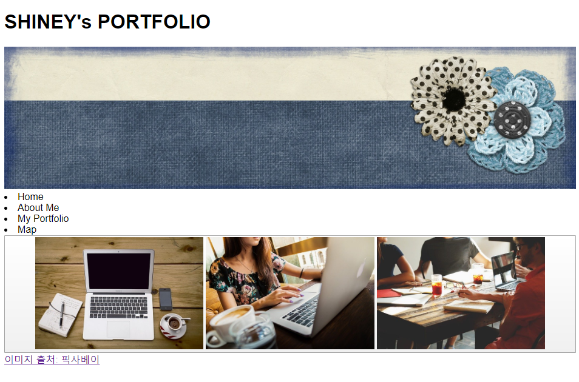
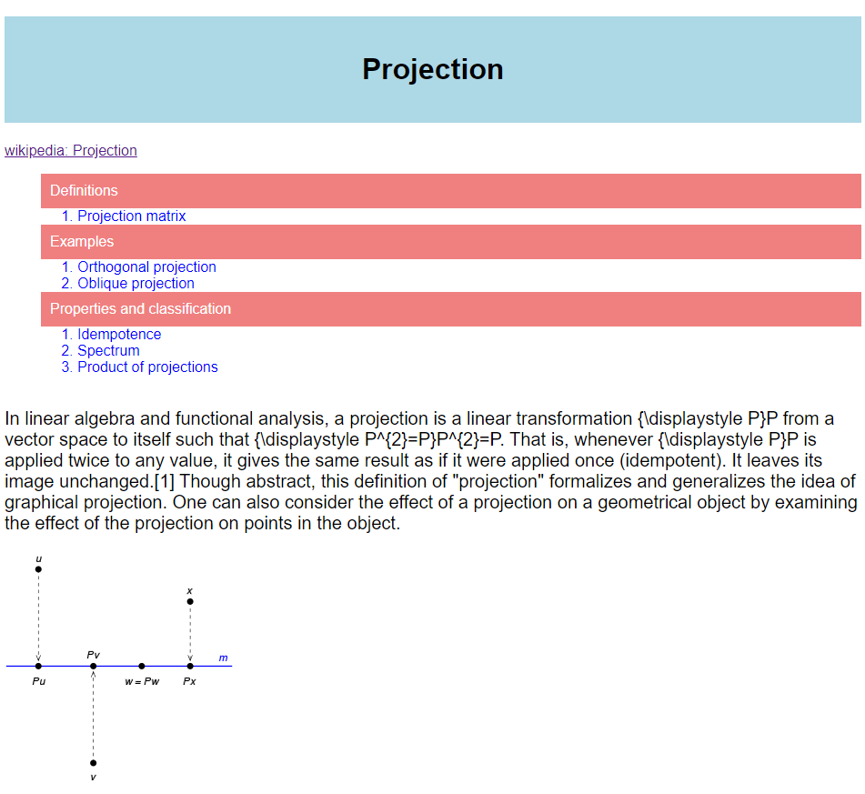
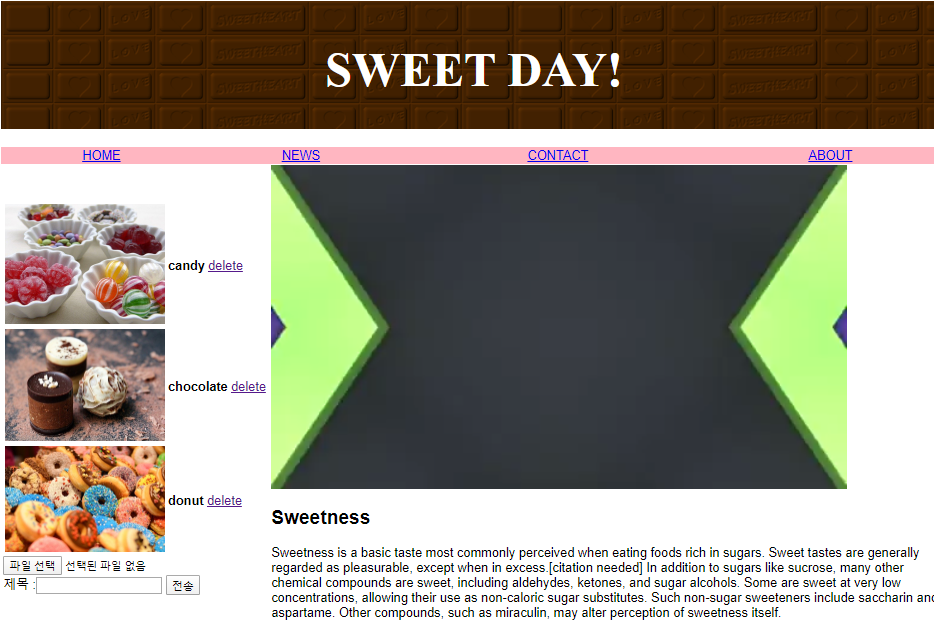
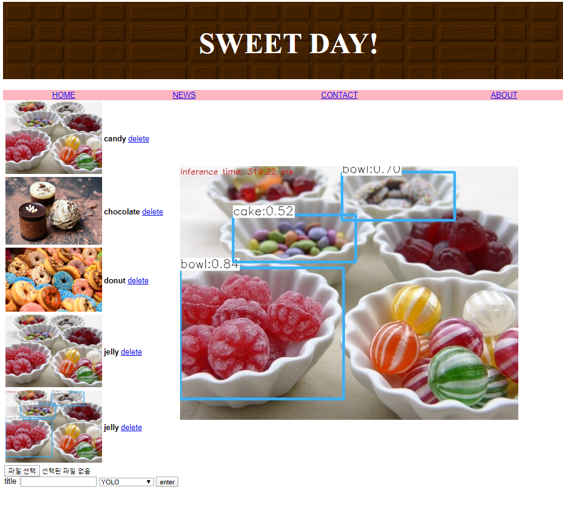
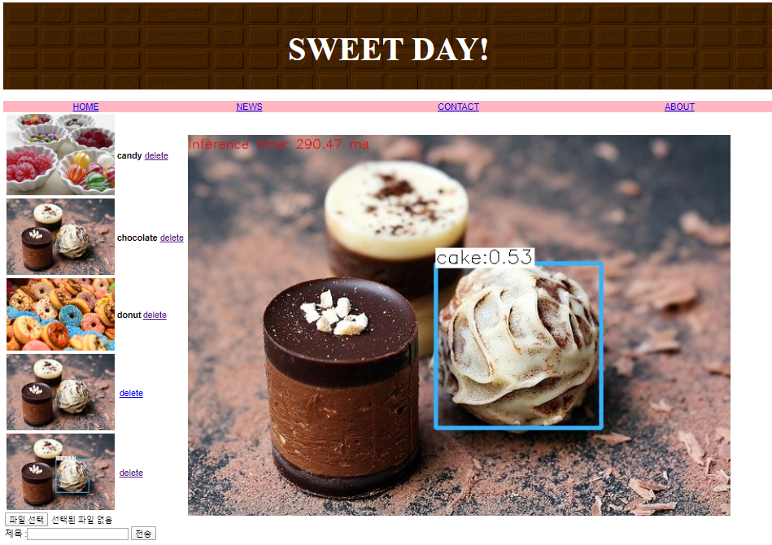

# HTML, CSS, JS 

---

> Algorithm study in Baekjun site
> [BAEKJOON ONLINE JUDGE](https://www.acmicpc.net/)

## 1. HTML, CSS 
- [HTML_BASIC](https://github.com/shiney5213/HTML-CSS-study/blob/master/HTML%2CCSS/1.1_HTML_basic.html) : ui, li, div 개념 익히기
- [HTML_STRUCTURE](https://github.com/shiney5213/HTML-CSS-study/blob/master/HTML%2CCSS/1.2_HTML_structure.html) : header, section, nav, botton 개념 익히기
- [HTML_CSS]((https://github.com/shiney5213/HTML-CSS-study/blob/master/HTML%2CCSS/1.3. CSS_id%2C class.html)): id, class 개념 익히기
<table>
    <tr>
    <td></td>
    <td></td>
    <td></td>    
    </tr>
</table>

## 2. Flask 
- [Html  video](https://github.com/shiney5213/HTML-CSS-study/blob/master/HTML%2CCSS/2.1.flask_image%2Cvidio.html) : table, font-family, video 개념 익히기
- [Html yolo](https://github.com/shiney5213/HTML-CSS-study/blob/master/HTML%2CCSS/2.2.flask_image%2Cyolo.html) : img upload, delete, yolo 이용해서 Image Detection
- [Flask_yolo](https://github.com/shiney5213/HTML-CSS-study/blob/master/HTML%2CCSS/2.1_flask_web.py) : get, post method, template 
<table>
    <tr>
    <td></td>
    <td></td>
    <td></td>    
    </tr>
</table>